# MagicTrackRest+

* ファームウェア remap対応版 [mentakoya_mtr_via.hex](https://raw.githubusercontent.com/mentako-ya/magictrackrest-qmk/main/mtr/)

* remap用キーレイアウト定義 [mentakoya_mtr_via.json](https://raw.githubusercontent.com/mentako-ya/magictrackrest-qmk/main/mtr/mentakoya_mtr_via.json)

* ご自身でファームウェアを更新、ビルドする場合、[こちら](qmk_firmware/keyboards/mentakoya/mtr/readme.md)

* ハードウェアビルドガイドは[こちら](buildguide/buildguide.md)

* Bluetooth接続版　MagicTrackReast+BLE　のファームウェアは[こちら](https://github.com/mentako-ya/magictrackrest-zmk-config)

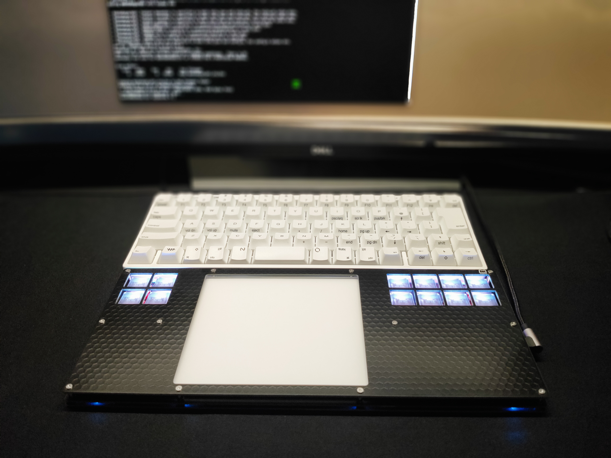

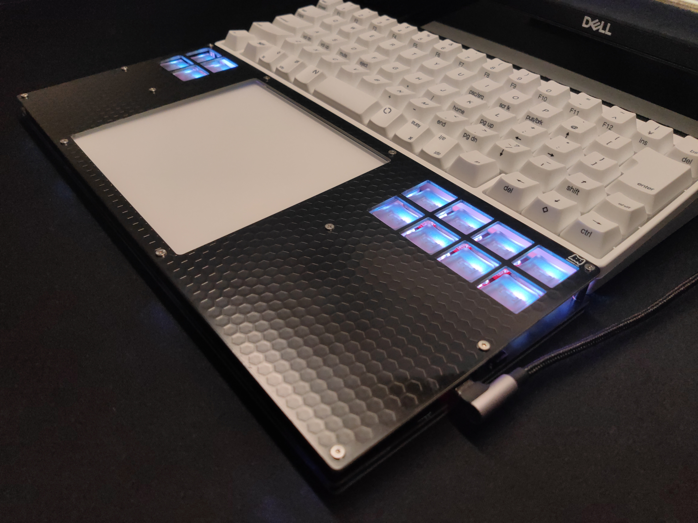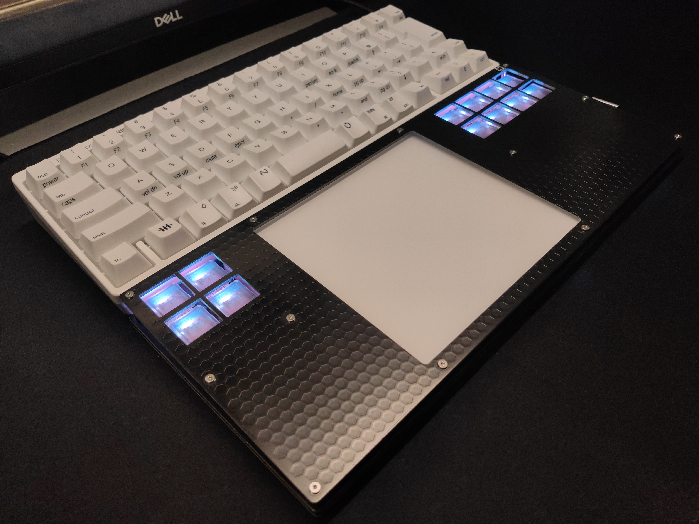

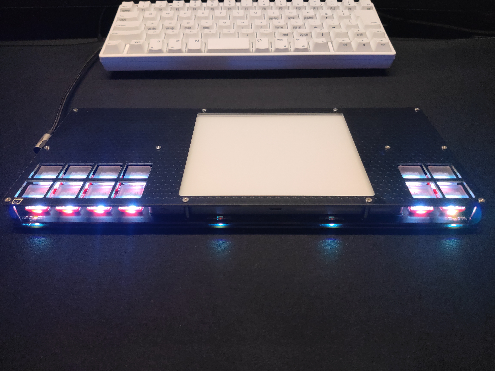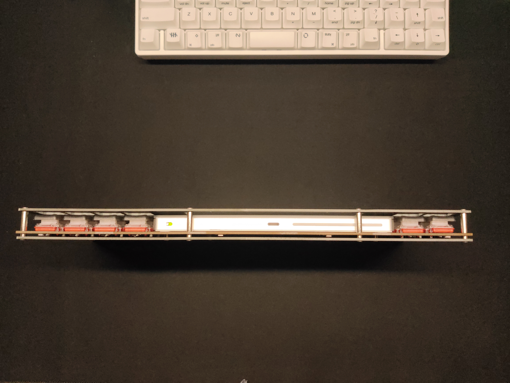

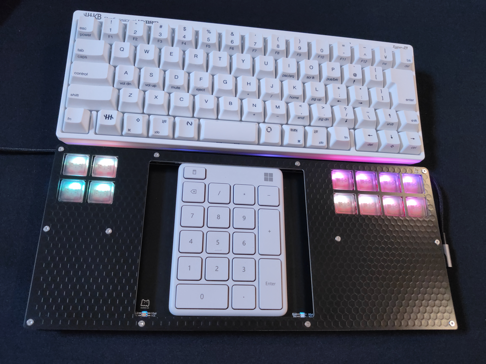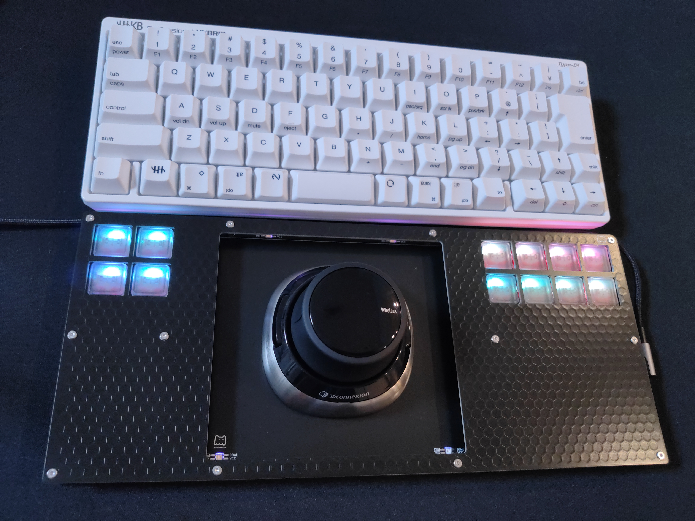

AppleのMagic Trackpad2,3を組込んで使用するパームレストと、キーボードを組み合わせた自作キーボードです。

MagicTrackpad以外にも、テンキーパッド、各種コントローラー、メモ用紙など、いろいろな物を中央にセットすることができ、両手をキーボードから動かさずに操作が可能です。

有線版、Bluetooth版、いずれかの構成で作成可能です。

#### 有線版　MagicTrackRest+
* MCUボード:ProMicro互換機
* ファームウェア:QMKベース  
* 接続方式:USB Type-c
* その他:https://remap-keys.app/ による動的マッピング変更　（ブラウザのみで変更可能）

#### Bluetooth版　　MagicTrackRest+BLE
* MCUボード:Seeed XIAO BLE nRF52840
* ファームウェア:ZMKベース　https://github.com/mentako-ya/magictrackrest-zmk-config
* 接続方式:Bluetooth 5.0 最大５台接続 / USB Type-c 有線接続可
* 電源:充電式リチウムイオンポリマーバッテリー　3.7v 250mAh~　保護回路付き　Type-c接続充電
* その他:keymapファイル書き換えによるマッピング変更　　GitHub Actionsによる自動ビルド　（ブラウザのみで変更可能）

#### WindowsでのMagicTrackPad利用  
  
WindowsでMagickTrackpad2,3ご使用の方はMagickTrackpad2,3のWindowsドライバを合わせてご使用ください。

* [Windows Precision Touchpad Implementation](https://github.com/imbushuo/mac-precision-touchpad)　＜　無償のドライバー トラックパッドを検出しないことがあり不安定、お試し用

* [Magic Utilities](https://magicutilities.net/)　＜　有償のドライバー 安定、高機能、おすすめ

### 各部のサイズ

HHKBなどの６０％キーボードと組み合わせて使用する想定のサイズになっています。パームレスト天板は　MagicTrackPadに合わせて、手前に向かって傾斜しています。

MagicTrackpad露出部のサイズは幅120mmで、MacBookAirのトラックパッドと同じ横幅になっています。

トラックパットの両脇を覆うことでキーボード操作時の誤タッチを避けつつ、MagicTrackpadを内蔵したパームレストとして使用できます。

トラックパッド露出部はホームポジション（FキーとJキー）に合わせて左側にオフセットしてあります。

※露出部分の誤タッチを避けるため、タップでクリックの機能はOFFで使用するか、感度を下げてご使用をお勧めします

パームレスト 外形
* 幅 294mm
* 奥行 127.5mm
* 前端部高さ 13.5mm スペーサーにて調整可能※
* 後端部高さ 20mm   スペーサーにて調整可能※

※ [金属スペーサー丸型両メネジM2]（https://www.hirosugi-net.co.jp/shop/c/c10141012/）を使用

MagicTrackpad 収納部
* 幅 160mm
* 奥行 114.5mm

MagicTrackpad トラックパッド上面露出部
* 幅 120mm
* 奥行 110.5mm

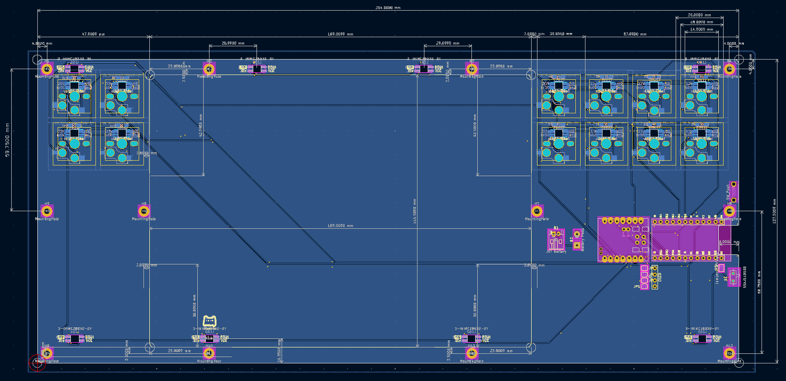

### キースイッチ

キースイッチにはUS配列の６０％キーボードでは省略されがちなカーソルキーや言語切り替えキー、各種ショートカットキーなど任意のキーをマッピングして使用できます。

キースイッチは誤押下防止のため、トッププレートの格子の下にセットされています。

押しずらい場合はトッププレートの格子部分をやすりなどでカットしてご使用いただくか、厚めのキースイッチをご使用いただくなど、工夫してみてください。

トッププレートとミドルプレート間のスペーサーを変更してトッププレートからキーまでの高さを調整することも可能ですが、１ｍｍ以上短かくすると、トッププレートがトラックパッドに干渉するかもしれません。

キーマピングの変更は https://remap-keys.app/ を使用してドラックアンドドロップで簡単に変更可能です。
専用ソフトウェアのインストールは不要です。

フルカラーLEDは色相、点灯パターン、ON/OFFをキーボード操作で調整可能です。

## MagicTrackPadの組込

パームレスト天面のT5ネジ１２本を[T5のヘクスローブドライバー](https://www.amazon.co.jp/アネックス-ANEX-ヘクスローブドライバーT型-T5×50-No-6300/dp/B002SQLDS2)を使用して取り外し、MagicTrackPad2,3 を中央にセットします。(初代のMagickTrackPadは形状が異なるので収まらないと思います)

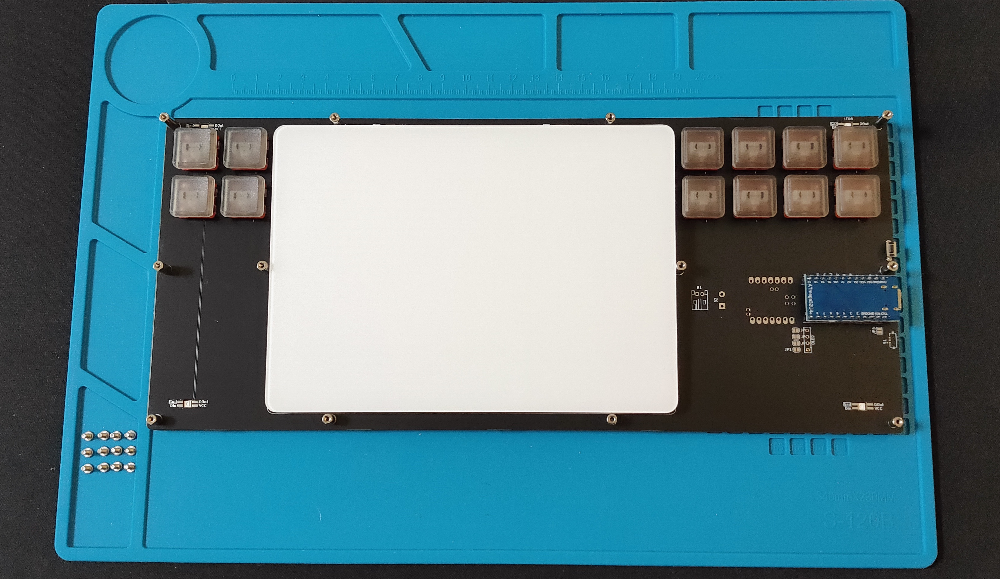

ネジを閉める際は、先ず全てのネジを1~2mm程ネジ山を残して取り付けます。全てのネジが無理なく取り付けできたら、少しずつネジを締めて完成です。
　
 
## キーマップ変更

　※以下は有線版の手順。　無線版　ZMKファームウエアは[こちら]https://github.com/mentako-ya/magictrackrest-zmk-config

キーマップの変更はChromeブラウザを使用して、https://remap-keys.app/ で変更します。

下記に本キーボードをremapでキーマップ変更する際に最低限必要な手順を記載します。

remapの一般的な使用方法はサリチル酸さんの記事などをご参照ください。

　https://salicylic-acid3.hatenablog.com/entry/remap-manual

1. [START REMAP FOR YOUR KEYBORD]　をクリック

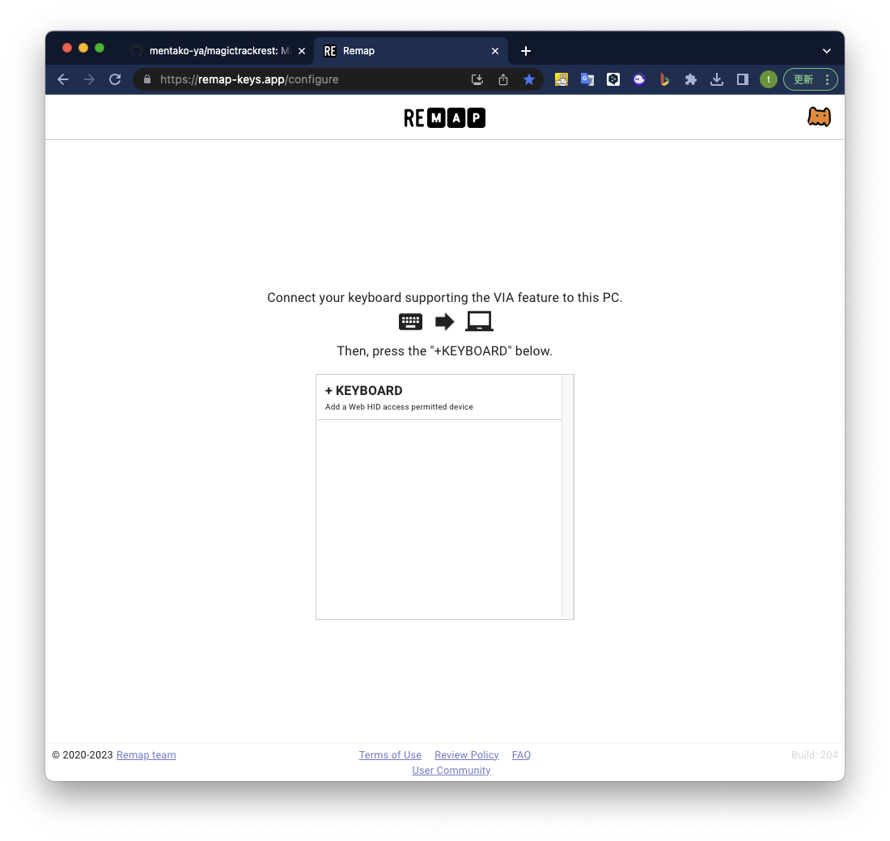

2. [+ KEYBORD]をクリック

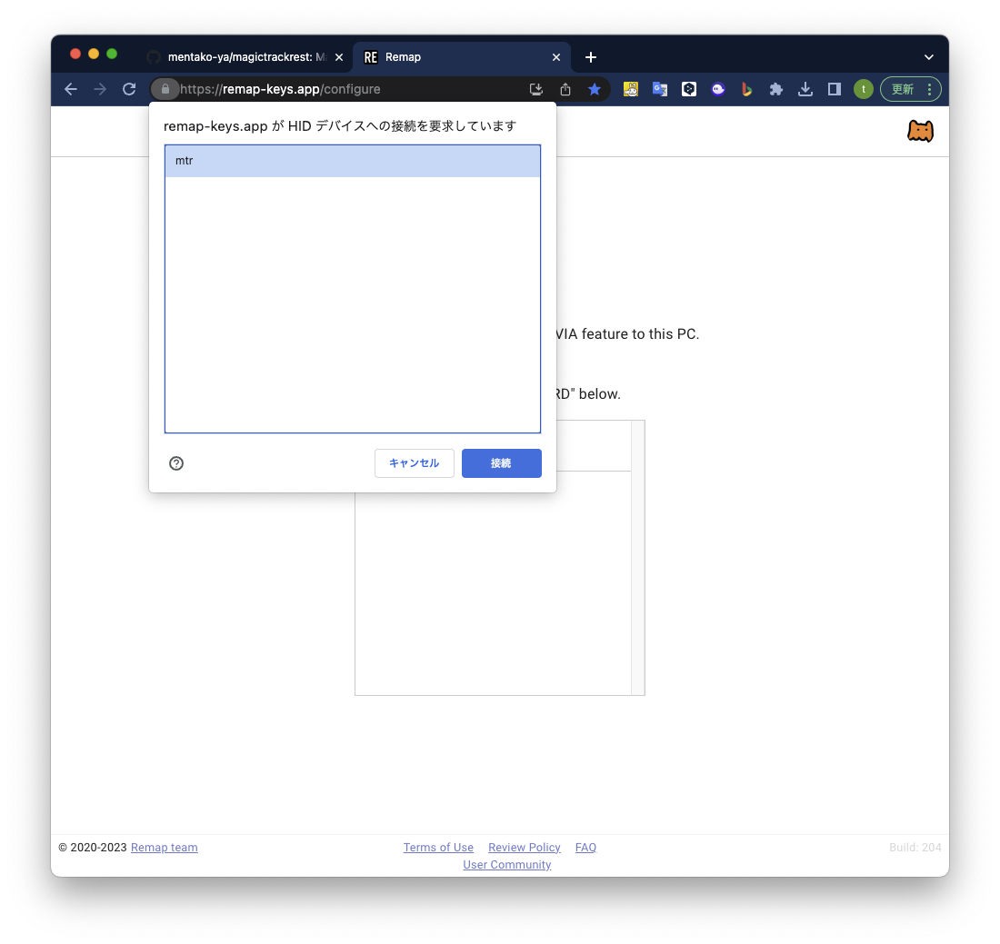

3. [mtr]を選択して接続.

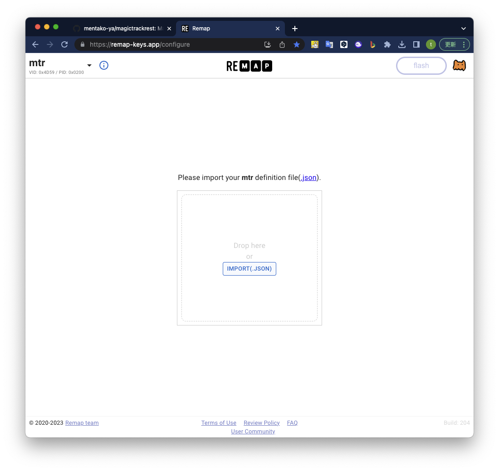

4. Jsonファイルのアップロードを求められるので、下記からjsonファイルをダウンロードして使用する

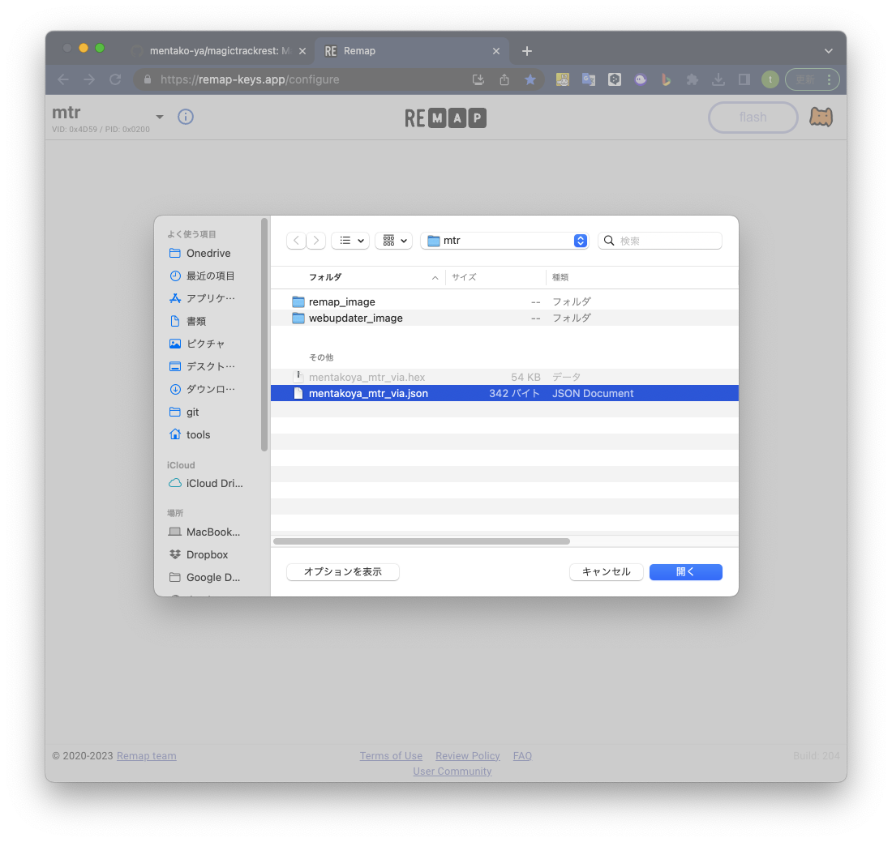

- [mentakoya_mtr_via.json](https://raw.githubusercontent.com/mentako-ya/magictrackrest-qmk/main/mtr/mentakoya_mtr_via.json)

5. キーマップの変更 / キーマップの書き込み（右上Flashボタン） /　変更したキーマップの保存　/　キーマップのPDFダウンロード　などが可能

キーマップサンプル
- カーソル,shift,ctrl,LED調整

 [keymap_cheatsheet_mtr_cursor_shift_ctrl.pdf](mtr/remap_image/keymap_cheatsheet_mtr_cursor_shift_ctrl.pdf)

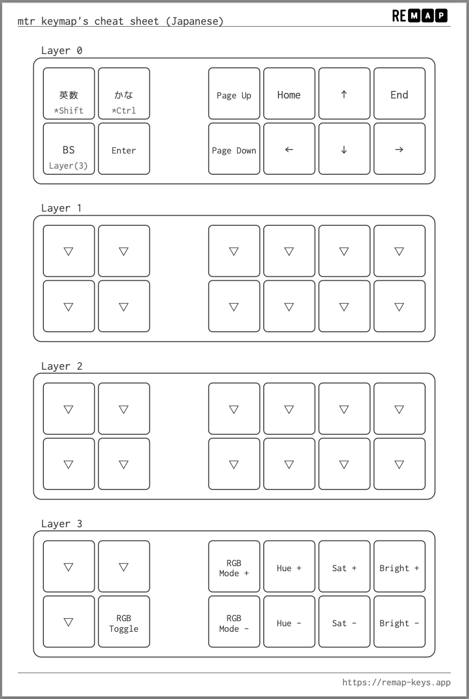

- カーソル,マウスキー,メディアキー,LED調整

 [keymap_cheatsheet_mtr_cursor_mouse_media.pdf](mtr/remap_image/keymap_cheatsheet_mtr_cursor_mouse_media.pdf)

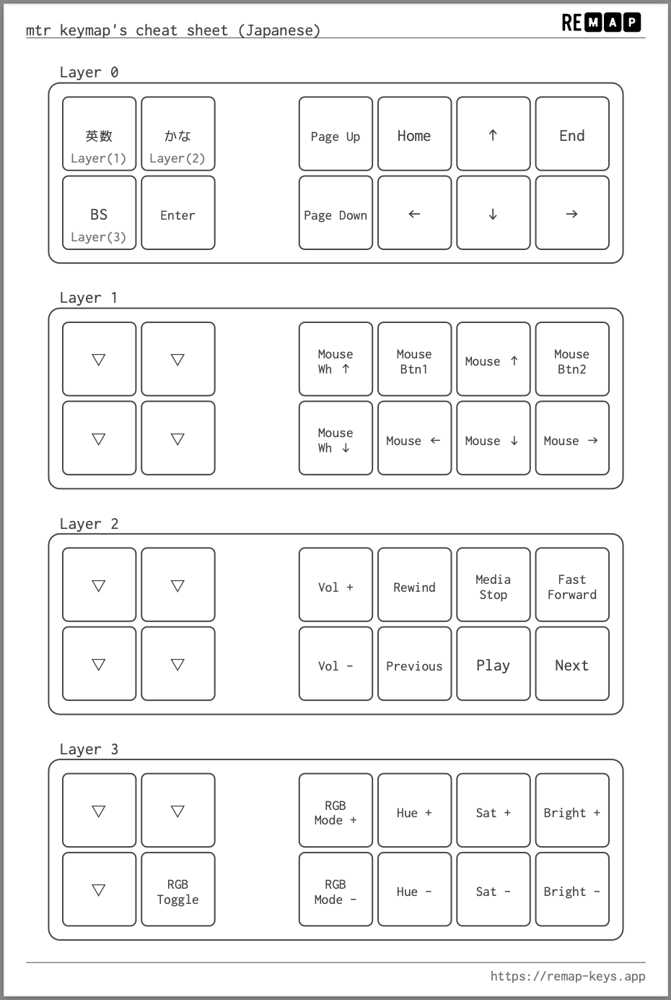

※ 製品出荷時点でキーボードに設定済みのマッピングは、ファームウェアのデフォルトキーマッピングとは一部異なる場合があります。

キーマップのリセットや、キーボードの初期化を行うと、キーマップはファームウェアのデフォルトキーマップにリセットされます。

キーマップ変更やリセットを行う前に、初期のマッピングの状態でマップの保存をお勧めします。

## ファームウェア更新

　※以下は有線版の手順。　無線版　ZMKファームウエアは[こちら]https://github.com/mentako-ya/magictrackrest-zmk-config
 
[Pro Micro Web Updater](https://sekigon-gonnoc.github.io/promicro-web-updater/index.html)を使用してファームウェアを更新できます。

出荷時に書き込まれているファームウェアは[mentakoya_mtr_via.hex](https://raw.githubusercontent.com/mentako-ya/magictrackrest-qmk/main/mtr/)です。　

ご自分でファームウェアをビルドする場合、[こちら](qmk_firmware/keyboards/mentakoya/mtr/readme.md)をご参照ください。

1. [Pro Micro Web Updater](https://sekigon-gonnoc.github.io/promicro-web-updater/index.html)にアクセスし、事前にダウンロードしたファームウェアをアップロードします。

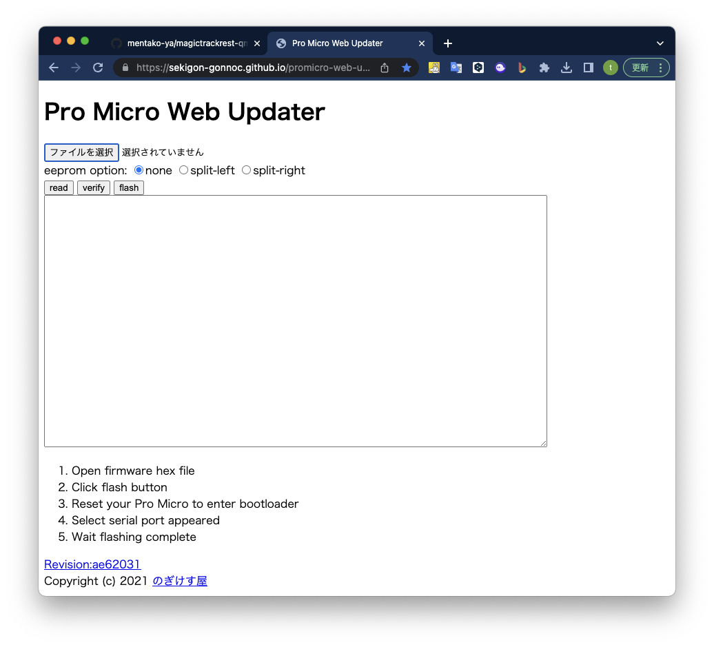
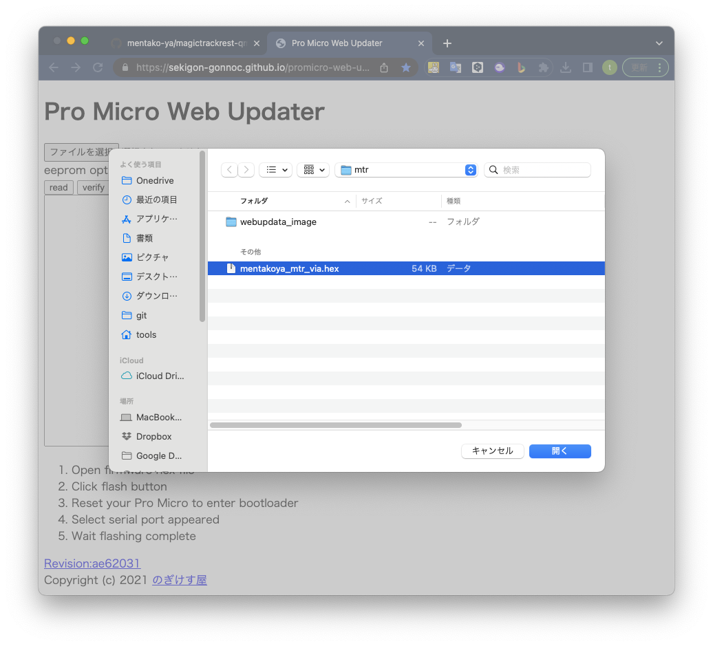

2. キーボードをUSB接続し、画面上の[flash]ボタンを押下します。

3. シリアルポートへの接続要求のウインドウが表示されるので、キーボード右側のリセットスイッチを２回連続でクリックします。

4. シリアルポートの一覧に「Pro Micro 5v」が表示されるので、選択して接続ボタンを押下します。

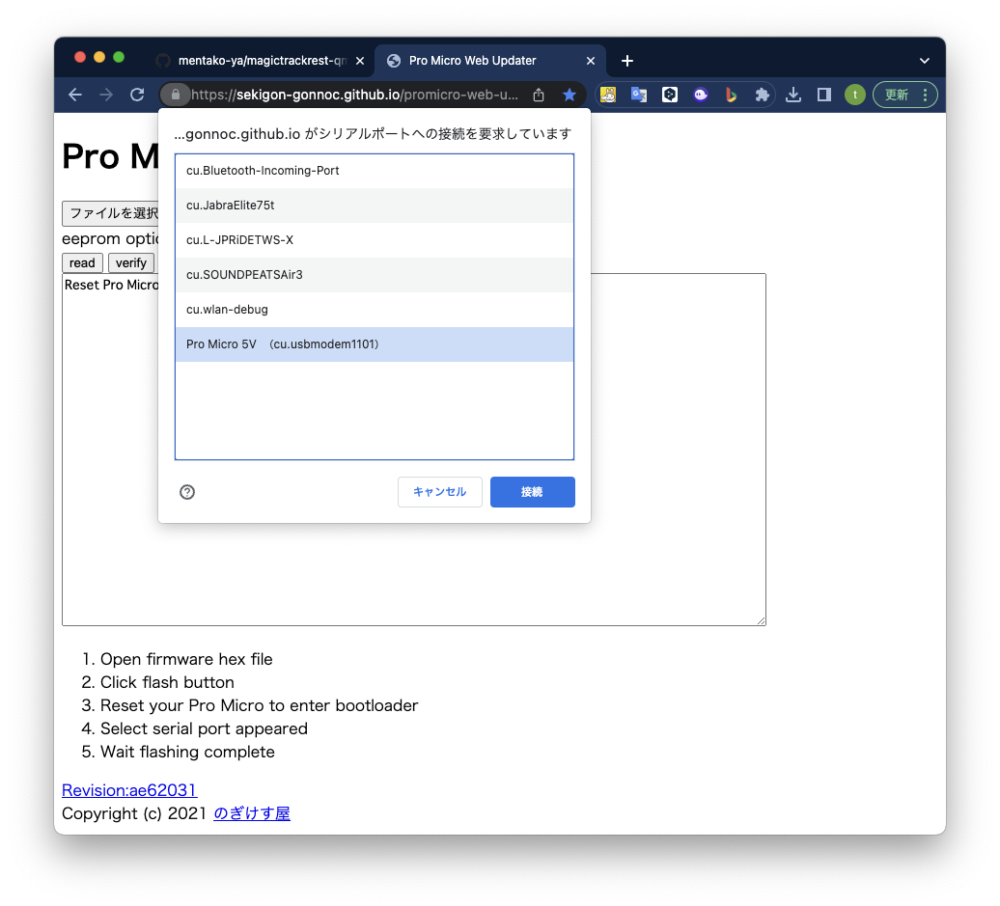

5. ファームウェアの書き込みが始まり、　Verify OK.のメッセージが表示されれば書き込み完了です。

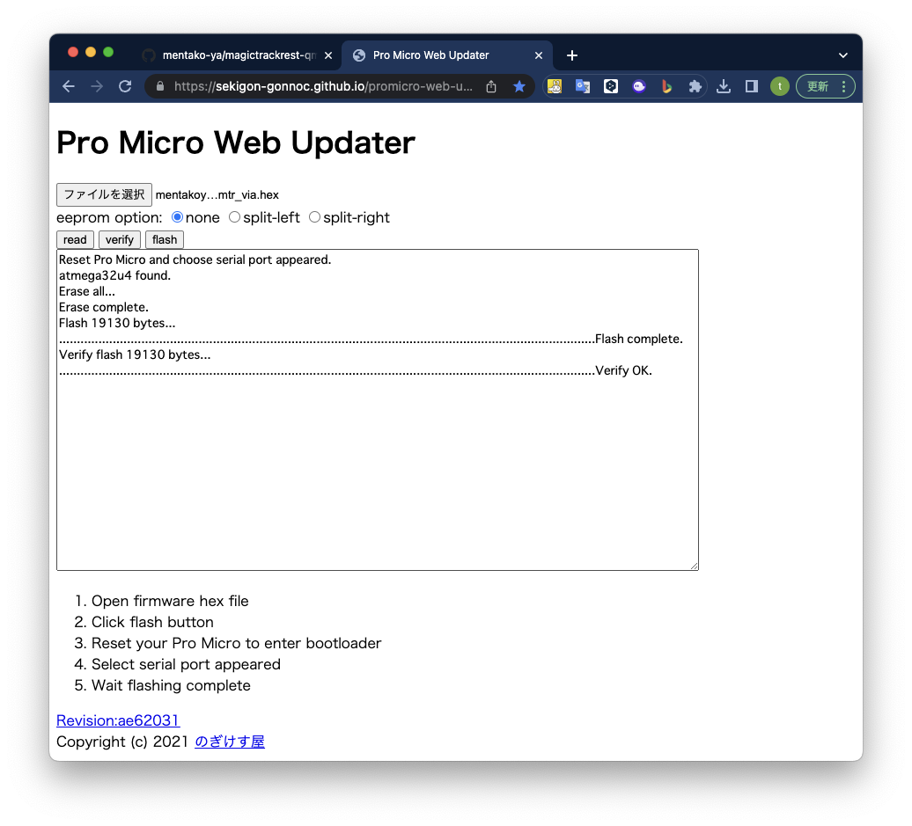

## 基本的な使用方法

本キーボードは、レイヤー０〜3の４種類のキーマップを切り替えて使用します。

レイヤーの切り替えは左側キーのHOLD（シフトキーのように押したままにすること）に割り当てられており、Layer(0),Layer(1),Layer(2),Layer(3)の切り替えが可能です。

設定例
- レイヤー０:カーソル入力
- レイヤー１:マウスキー入力
- レイヤー２:メディアキー入力
- レイヤー３:LED調整
