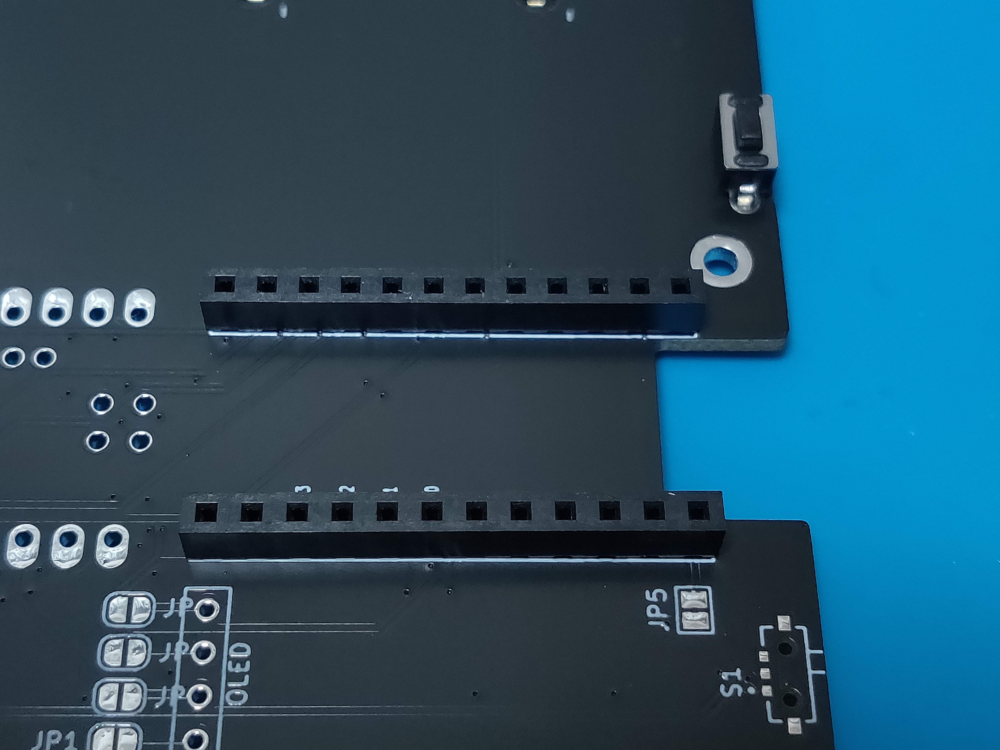
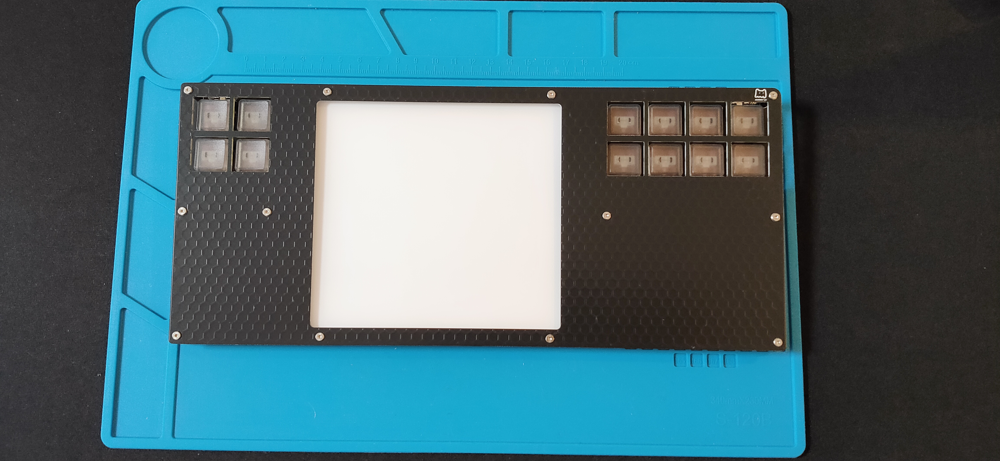

# MagicTrackRest+ / MagicTrackRest+BLE ハードウェアビルドガイド

ハードウェアの組み立て手順です。

！！重要！！

本キーボードの組み立て、使用、保管中の事故、火災、接続機器の故障などの損害について、一切保証できません。全て自己責任でご使用ください。

特にリチウムポリマーバッテリーの取り扱いには十分ご注意ください。

＋ーのつけ間違い、部品の製造ミス、配線ミス、本ページの記載誤りなどにより、感電、発熱、発火、爆発する可能性があります。

## MagicTrackRest+（type-c接続 remap対応 QMKファームウェア版） 必要部品

| 名前 | 数 | 備考 |
|:-|:-|:-|
| ミドルPCB | １枚 |ダイオードx12、Kailh Choc V1用キーソケットx12ハンダ済み |
| トップPCBプレート | １枚 | |
| ボトムPCBプレート | １枚 | |
| ProMicro type-c | 1個 | |
| ProMicro用ピンヘッダ(1.5mm 12ピン) | 2本 |コンスルー2.5mm or 3.5mm１２ピンでも可能|
| ProMicro用ピンソケット(3.5mm 12ピン) | 2本 |コンスルー使用時は不要 |
| タクトスイッチ | 1個 |リセットスイッチ |
| 平頭T5ネジ M2x8mm | 12本 | バックプレート側に使用 |
| 平頭T5ネジ M2x5mm | 12本 | トッププレート側に使用 |
| スペーサー M2x13mm 両メネジ | 4本 | |
| スペーサー M2x9.5mm  両メネジ | 4本 | |
| スペーサー M2x6mm  両メネジ | 4本 | |
| スペーサー M2x2mm ネジなし| 12本 | バックプレート-ミドルプレートの間に使用 |
| YS-SK6812MINI-E | 20個 | オプション　アンダーグローx8、キーバックライトx12 |

### MagicTrackRest+BLE(Bluetooth接続 ZMKファームウェア版） 必要部品

※の部品はBLE専用。　type-c有線仕様から変更の場合に追加が必要になります。

| 名前 | 数 | 備考 |
|:-|:-|:-|
| ミドルPCB | １枚 |ダイオードx12、Kailh Choc V1用キーソケットx12ハンダ済み |
| トップPCBプレート | １枚 | |
| ボトムPCBプレート | １枚 | |
| タクトスイッチ | 1個 |リセットスイッチ |
|※ Seeed XIAO BLE | 1個 | https://www.switch-science.com/products/8145　https://wiki.seeedstudio.com/XIAO_BLE/#hardware-overview|
|※ ピンヘッダ(2.5mm 7ピン) | 2本 |　3.5mmソケット　＋　ピン（XIAO BLEに直付け）で差し込み式にする場合、スペーサーを＋１ミリ長いものを使用　|
|※ リチウムポリマー電池 | 1個 | 保護回路付き 3.7v 250mAh程度 https://www.amazon.co.jp/dp/B08LKBMW73?psc=1&ref_=cm_sw_r_cp_ud_ct_X67ZG24A3GWM1WXHYNRY　|
|※ バッテリーコネクター　オス | 1個 | JST製2ピンPHコネクタ|
|※ バッテリーコネクター　メス | 1個 | JST製2ピンPHコネクタ|
|※ pogoピンコネクタ H4オス| ２個 | XIAO BLE バッテリー、リセット端子接続用|
|※ 電源スイッチ | 1個 | https://tech.alpsalpine.com/j/products/detail/SSAJ110100/|
|※ 耐熱絶縁ビニル電線　 | 3本 | 電源スイッチ、リセット端子、LED配線接続用|
| 平頭T5ネジ M2x8mm | 12本 | バックプレート側に使用 |
| 平頭T5ネジ M2x5mm | 12本 | トッププレート側に使用 |
| スペーサー M2x13mm 両メネジ | 4本 | |
| スペーサー M2x9.5mm  両メネジ | 4本 | |
| スペーサー M2x6mm  両メネジ | 4本 | |
| スペーサー M2x2mm ネジなし| 12本 | バックプレート-ミドルプレートの間に使用 |
| YS-SK6812MINI-E | 20個 | オプション　アンダーグローx8、キーバックライトx12 |

## はんだ付け

ダイオードとキーソケットはハンダ付け済みです。

LED,ProMIcro,リセットスイッチを取り付けてはんだ付けは完了です。

BLEの場合、電源コネクタ、電源スイッチ、pogoピン、リセット接続、電源接続、LED接続用にビニール電線が必要です。

### LEDはんだ付け
オプションのLEDを使用しない場合、この手順はスキップしてください。

LEDはYS-SK6812MINI-Eを20個使用します。

LEDはキーボード外周に下向きで８個、キースイッチ部に表向きで８個取り付けます。

LED1~LED20までの各パットの右上のパット（写真ではVCC）に予備ハンダをつけます。

「GND」のシルクプリントにLEDの切り欠きを合わせてセットします。

キーボード外周はミドルPCB裏側から見て発光面が見える向きで取り付け、プラスチック本体の切り欠きの位置を「GND」に合わせます。

キースイッチ部はミドルPCB裏側から見て発光面が見えない向きで取り付け、切り欠きのある端子の位置を「GND」に合わせます。

予備ハンダをした右上のパットをはんだ付けします。

残りのパッドを各LEDごとに１つずつハンダします。一度に１つのLEDの全部の足をハンダ付けすると、熱でLEDが故障する可能性があります。

### リセットスイッチ,ProMicroソケットはんだ付け　※BLE仕様の場合、ProMicroソケットは不要

リセットスイッチとProMicroソケットをミドルPCBの表側に取り付けます。コンスルーを使用する場合はピンソケットは不要です。

スルーホールにリセットスイッチとソケットを取り付けます。

ソケットをマスキングテープなどで仮止めします。

ソケットとリセットスイッチをはんだ付けします。

### ProMicroピンヘッダはんだ付け　※BLE仕様の場合、不要

ProMicroにピンヘッダをはんだ付けします。
コンスルーを使用する場合はピンヘッダの代わりにコンスルーをProMicroにはんだ付けします。

ピンソケットにピンヘッダを取り付けます。
コンスルーを使用する場合は基盤のスルーホールにコンスルーを差し込んでください。

ピンソケットにProMicroを載せてハンダ付けします。

## BLE実装

### XIAO BLE用ピンソケット　※BLE仕様の場合のみ

XIAO BLE用のソケットを取り付けます。

ソケットは７ピン3.5mmのソケットを用意するか、ProMicro用の１２ピンのソケットを７ピンに切断して使用します。

### XIAO BLE　ピンヘッダ取り付け　※BLE仕様の場合のみ

XIAO BLEは部品が実装された面を上にして使用します。（裏面に電源端子などがあるため裏返せない）

部品の高さがあるため、ソケット＋ピンヘッダをXIAO BLEの下側につけると、トッププレートに干渉します。

本キーボードでは、トッププレートとXIAO BLEの干渉を避けるため、特殊な取り付け方をします。

まず、ピンヘッダのプラスチックの一方だけピンが飛び出すように、ピンヘッダを加工します。

（ペンチを開いてプラスチック部とピンの先端を挟み込むようにして、ピンずらします。）

基盤に取り付けたソケットにXIAO BLEを載せ、上から加工したピンヘッダを３ｍｍ程度差し込みます。

XIAO BLEの表面から、ピンヘッダをはんだ付けします。

ピンヘッダをはんだ付けしたら、ソケットからXIAO BLEを取り外します。

XIAO BLEの上面側のピンヘッダをプラスチックごとカットします。

### pogoピンはんだ付け　※BLE仕様の場合のみ

XIAO BLE用のソケットの間にpogoピン取り付けます。

pogoピンはXIAO BLE裏面「BAT+」と「RST」のパッドに当たるよう取り付けます。

「BAT+」と「RST」以外のパッド分はpogoピンを取り付けないでください。（ショートの原因になります）

### 電源スイッチ　※BLE仕様の場合のみ

電源スイッチを取り付けます。
※本来表面実装部品なので手ハンダでは難易度が高いですが、フラックスを使用して取り付けることはできます。

電源スイッチのパッド、（足左右＋スイッチ配線）に予備半田を極少量つけます。

部品が非常に小さいため、ハンダをつけすぎるとスイッチがショートします。

電源スイッチ裏面の突起と基盤の取り付け穴を合わせて位置を決め、細くカットしたマスキングテープで中央部を押さえて仮止めします。

フラックスを多めに塗布して、左右の足をはんだ付けします。（予備ハンダのみではんだ付けします。追加のハンダを乗せるとショートしてしまいます。）

マスキングテープを取り除き、再度フラックスを塗布して、電極のパッド付近にはんだごてを当てて、電極をはんだ付けします。

フラックスクリーナーなどで、スライド部分のフラックスを除去します。

### バッテリー用端子　※BLE仕様の場合のみ

！！！まだバッテリーは基盤に接続しないでください！！！

端子を取り付ける前に、基盤側の極性（＋ー）とバッテリーの極性（＋ー）をよく確認してください。

！！！！！Amazonなどで販売されているLipoバッテリーで、オス端子がついているものもありますが、極性が基盤側の極性と逆になっています。！！！！！

バッテリーの端子を入れ替えて付け直すか、基盤側のソケットをバッテリーの極性に合わせて逆向きにつけるなど加工が必要になります。

基盤側にバッテリーコネクター　メスを取り付けます。 

基盤側の極性とバッテリー側の極性が合うように、バッテリーの配線にバッテリーコネクター　オスを取り付けます。

※ ＋とーを両方一度に作業すると、配線がショートして、感電、破裂、火災の危険があります。
必ず一方をビニールテープなどで絶縁した状態で、片方ずつ作業してください。

### ジャンパ線取り付け　※BLE仕様の場合のみ

基盤を裏返して、ジャンパ線を取り付けます

XIAO BLE BAT+用pogoピンの裏側と、ProMicro用のRAW端子パッドをジャンパで接続します。(赤色のリード線)

XIAO BLE RST用pogoピンの裏側と、ProMicro用のRST端子パッドをジャンパで接続します。（茶色のリード線）

LED用の配線をジャンパで接続します。
ProMicro用のD４・SCL端子パッドとProMicro用のLED端子パッドをジャンパで接続します。（黄色のリード線）

### 各配線の接続確認

バッテリー、XIAO BLEを取り付ける前に、配線図を参考に、テスターを使用して、各配線の接続と短絡を検査します。

電源スイッチONで、バッテリーソケットの＋端子とXIAO BLEのBAT+下のpogoピンが導通することを確認します。

電源スイッチOFFで、バッテリーソケットの＋端子とXIAO BLEのBAT+下のpogoピンが導通していないことを確認します。

リセットスイッチを押した状態で、各所のGND端子とXIAO BLEのRST下のpogoピン間が導通することを確認します。

リセットスイッチを押していない状態で、各所のGND端子とXIAO BLEのRST下のpogoピン間が導通していないことを確認します。

BAT+、RSTのpogoピンと周辺の部品間に短絡がないことを確認します。

### XIAO BLE取り付け　※BLE仕様の場合のみ

２．５ｍｍピンヘッダを使用して、基盤にXIAO BLEを取り付けます。

pogoピンのスプリングの力でBLEが浮き上がるので、クランプやテープでBLEを押さえてはんだ付けします。

### バッテリー取り付け　※BLE仕様の場合のみ

電源スイッチをOFFにして、バッテリーを取り付けます。

バッテリー接続後に電源スイッチをONにします。

※バッテリーの発熱、ショートなど異常があればすぐに取り外してください。

この時点ではLEDなどは点灯しないため、見た目は動作が分かりませんが通電しています。

type-cケーブルで給電をするとXIAO BLEのLEDが緑に光り、充電中であることを確認できます。（電源スイッチをONにして充電します）

### ファームウェア書き込み、動作確認

#### 有線版の場合

[ファームウェア更新](https://github.com/mentako-ya/magictrackrest-qmk#ファームウェア更新)の手順に従い、ファームウエアを書き込み、動作確認してください。

#### BLE版の場合

[magictrackrest-zmk-config](https://github.com/mentako-ya/magictrackrest-zmk-config)の手順に従い、ファームウエアを書き込み、動作確認してください。

### バックプレート取り付け
バックプレートをミドルPCBに取り付けます。

バックプレートを浮かせて作業するため、消しゴムなど適当な大きさの物をバックプレートの下に敷きます。

平頭T5ネジ M2x8mm 12本をバックプレートに取り付けます。

平頭T5ネジをマスキングテープなどでバックプレートに仮止めします。

全てのネジを仮止めしたら裏返します。

スペーサー M2x2mm ネジなし 12本を取り付けます。

ミドルPCBをバックプレートに重ね、ネジ穴にバックプレートに取り付けたネジを通します。

ミドルPCB側にメスネジつきのスペーサーを取り付けます。
| 名前 | 数 | 備考 |
|:-|:-|:-|
|スペーサー M2x13mm 両メネジ | 4本 |奥側 |
| スペーサー M2x9.5mm  両メネジ | 4本 |中央 |
| スペーサー M2x6mm  両メネジ | 4本 |手前側 |

スペーサーの長さを変更することで、トッププレートの高さや角度を調整可能です。

BLE仕様でトッププレートとXIAO BLEが干渉する場合や、トッププレートを外さずにtype-cケーブルで充電したい場合、スペーサーを１〜２ｍｍ長いものに交換してください。

スペーサーは[ヒロスギネット](https://www.hirosugi-net.co.jp/shop/c/c10141012/)などで購入できます。

### キースイッチ、キーキャップ取り付け,MagicTrackPad設置

キースイッチを取り付けます。ホットスワップ仕様ですのではんだ付け不要です。

キーキャップもトッププレートより先に取り付けます。

MagicTrackPadを設置します。

### トッププレート取り付け

平頭T5ネジ M2x5mmを使用して、トッププレートを取り付けます。

